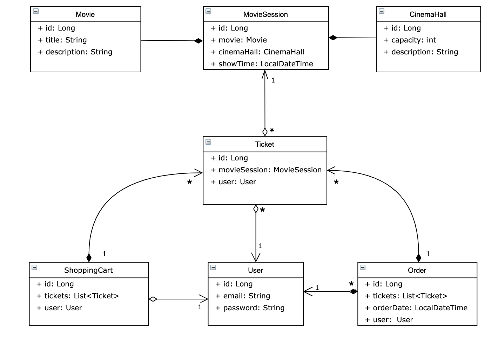

# Cinema shop
Project Description:

This is a movie theater web application. The client can `register` and `login` the application, he also has the opportunity to use the `CRUD` operation.

Accessibility to functions is limited by the status of the `admin`/`user` role.

# Features

This application has `authentication` and `authorization` functions. Also, this application stores data about `users`, `user roles`, `cinema`, `films`, `screenings`, `tickets`, `shopping carts` and `orders` in a MySQL database.

All `users` have access to these endpoint: /`register` and /`login`

Features available to `User/Administrator`

- `Get` a list of all movies (`GET: /movies)`;
- `Get` a list of all cinema halls (`GET: /cinema-halls`);
- `Get` movie sessions by movie id (`GET: /movie-sessions/{id}`);
- `Get` a list of all movies that will be shown today (`GET: /movie-sessions/available`).

  `Admins`- only features

- `Add` movie (`POST: /movies`);
- `Add` movie session (`POST: /movie-sessions`);
- `Add` a cinema hall (`POST: /cinema-halls`);
- `Get` user by email (`GET: /users/by-email`);
- `Update` movie session(`PUT: /movie-sessions/{id}`);
- `Delete` movie session (`DELETE: /movie-sessions/{id}`).

`Usesr`- only features

- `Get` a list of all orders (`GET: /orders`);
- `Get` your shopping cart (`GET: /shopping-carts/by-user`)
- `Add` your order (`POST: /orders/complete`)
- `Update` movie session (`PUT: /shopping-carts/movie-sessions`).

# Database structure of the project

# Technology Stack

- `Java 11`
- `Hibernate`
- `Spring Core`
- `Spring MVC`
- `Spring Security`
- `HQL`
- `MySQL`
- `Apache TomCat`
- `Maven`

# Instructions for running this app

- Clone this project.
- Install `MySQL` and create a schema.
- Set up your `url`, `driver`, `username` and `password` data to `db.properties` file.
- Set up `Apache TomCat Local Service` configuration and run application.
- Run project
- Use standard parameters for input:
- login:`admin@i.ua`
- password: `admin123`

